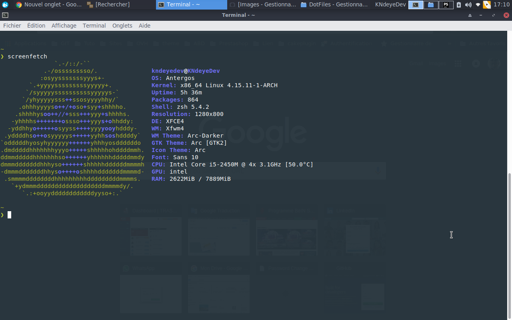

# A propos de mon conf
Ce dépôt contient les choses à savoir concernant mon installation de Linux.

[](https://raw.githubusercontent.com//k-ndeye/dotfiles/master/screenshot.png)

## Installer les paquets
La liste des paquets installés sont disponibles dans le fichier package.list. Les paquets AUR sont en fin de liste.
Le dossier custom et doit aller au .oh-my-zsh.


```
cat package.list | xargs yaourt -S --needed --noconfirm
```
